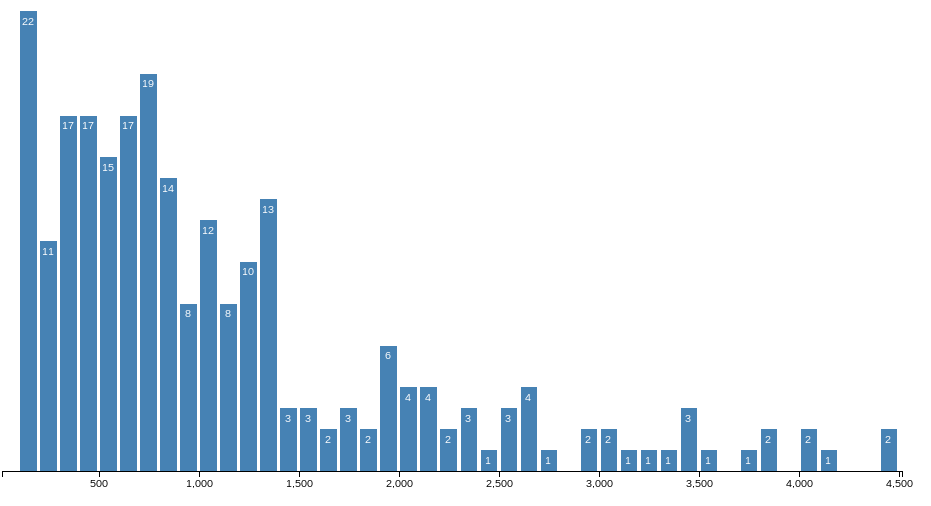
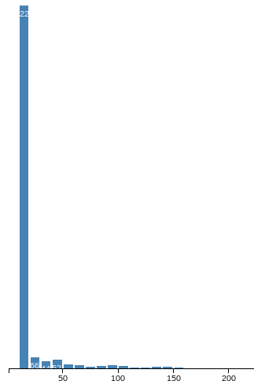

# Data Description

Wifi数据主要描述了终端设备在Wifi热点上的登录信息，每次设备接入Wifi热点时会产生一条记录。所以数据主要包括Wifi热点的位置信息和设备的接入日志两部分。

在Wifi普及的今天，我们的移动终端设备基本每时每刻都处在Wifi环境中，用户的终端设备每天都在各个Wifi热点间不停的切换，
而设备的登录情况在一定程度上能够反映用户的行为轨迹变化以及用户间的影响。
同时，研究wifi数据还有助于合理的放置wifi热点从而提高wifi热点的利用率。

我们的数据来自奇虎360公司，在360公司17层的大楼中分布着大量的wifi热点，每当有设备接入热点时就会生成一条登录记录，
所以我们的数据包括两部分：wifi热点信息和接入日志。wifi热点信息包括每个wifi热点的ID、名称和地理位置信息，
其中有热点所在的楼层和在楼层中的坐标，与之相对应的有每个楼层的平面图，平面图上标有热点所在的位置。
接入日志是指不同的终端设备在这些热点上的接入记录，每条记录包括终端设备的MAC地址、接入时间以及接入的wifi热点的ID。

接入记录从2013年7月19日开始到2013年10月10日结束，总共53天，17790560条记录。这些记录分布在17层大楼中的总共250个wifi热点上。数据大小为785.1M。

## Data Detail

There are 17 floors in the building of 360, and in each floor, there are several wifi AP station(hotspot),
now we have the plan of each floor and the position of AP in each floor.
When a device (pc or cell phone) get access to a AP, the AP takes a record.

So, now we have three type of data:

1. Plan figure of each floor, these firues do not share the same size (resolution). **1-17** Floor.

2. The AP Info
	Each AP has four attributes:
	- ID: ids is no continues, between 1 to 389, **250 total**.
	- Name: AP name, floor+ap_number style, "f15ap12, f1ap2" etc.
	- Floor: which floor does this ap locate
	- (x,y): position of AP

	```
	+----+------+---+---+-------+
	| ID | Name | x | y | floor |
	+----+------+---+---+-------+
	```
3. AP access record
	- date_time: access time
	- mac: end devices'MAC address, which is unique to devices.
	- ap id: id of AP the device accesses to.

	```
	+-----------+-----+------+
	| date_time | mac | apid |
	+-----------+-----+------+
	```


## Ap numbers at Each Floor and Records Num at Each Floor (**records in September**)

```
+------------+------+-------+-------+-------+------+-------+-------+-------+-------+-------+-------+-------+-------+-------+------+-------+-----+
| Floor      | 1    | 2     | 3     | 4     | 5    | 6     | 7     | 8     | 9     | 10    | 11    | 12    | 13    | 14    | 15   | 16    | 17  |
+------------+------+-------+-------+-------+------+-------+-------+-------+-------+-------+-------+-------+-------+-------+------+-------+-----+
| Ap Num     | 8    | 11    | 24    | 11    | 15   | 21    | 21    | 18    | 14    | 15    | 16    | 15    | 15    | 15    | 14   | 10    | 7   |
+------------+------+-------+-------+-------+------+-------+-------+-------+-------+-------+-------+-------+-------+-------+------+-------+-----+
| Record Num | 8032 | 11840 | 13987 | 10576 | 7228 | 20544 | 19995 | 18099 | 18565 | 41791 | 13064 | 23179 | 29650 | 28604 | 3734 | 14586 | 402 |
+------------+------+-------+-------+-------+------+-------+-------+-------+-------+-------+-------+-------+-------+-------+------+-------+-----+
```

**Some APs share the same location**

```
3,f1ap1,0,0,1
2,f1ap2,0,0,1
7,f1ap3,0,0,1
4,f1ap4,0,0,1
5,f1ap5,910,401,1
6,f1ap6,324,413,1
8,f1ap8,76,273,1
9,f1ap9,96,434,1
```

## Total number of devices(MACs): 10455

## Records By Week (**records in September**)

```
+------------+---------+---------+------------+----------+--------+----------+--------+
|            | Monday  | Tuesday | Whednesday | Thursday | Friday | Saturday | Sunday |
+------------+---------+---------+------------+----------+--------+----------+--------+
|            |         |         |            |          |        |          | 26885  |
| 2013-09-02 | 283876  | 323711  | 381636     | 343305   | 355862 | 48575    | 32167  |
| 2013-09-09 | 245578  | 428008  | 328191     | 359614   | 298312 | 164191   | 22658  |
| 2013-09-16 | 263143  | 293356  | 274786     | 23601    | 15087  | 21648    | 271122 |
| 2013-09-23 | 286820  | 291513  | 293953     | 336171   | 255806 | 37327    | 204301 |
| 2013-09-30 | 166765  |         |            |          |        |          |        |
+------------+---------+---------+------------+----------+--------+----------+--------+
| Total      | 1246182 | 1336588 | 1278566    | 1062691  | 925067 | 271741   | 557133 |
| Average    | 249236  | 334147  | 319642     | 265673   | 231267 | 67935    | 111427 |
+------------+---------+---------+------------+----------+--------+----------+--------+
```

## All Path Summary (**from record on September 2**)

sort records by time and group them by mac address, then we have path route for each mac address(device).

then, if a same ap ocurrs in a path consecutively, only the first is obtained.

### node summary:

- ap number: 250
- access time:[13, 4512]



### link summary: line between two ap is a link

- link number: 2549
- number scale: [1, 641]




