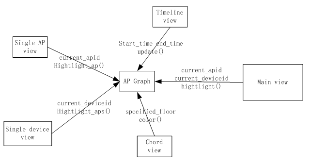
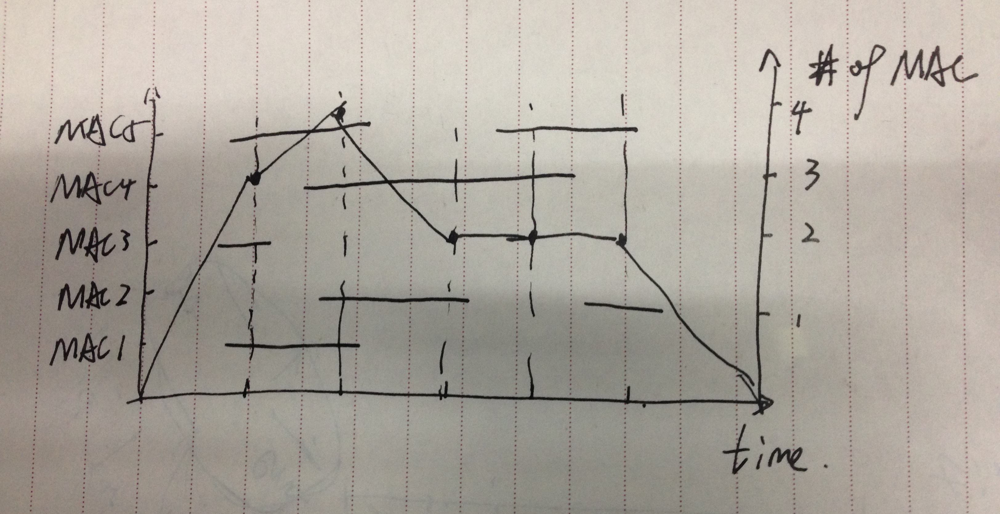

## Timeline View

### Function

basicly show MAC hit number over time, (need to define the smallest time range)

### Interacion

1. select a time range: _onBrushStart, onBrushMove, onBrushEnd_
	- output: [timeFrom, timeTo]
	- action:
		1. in this view: show summary info of selected range: **what info**
		2. in Floor Detail View:_updateDevice, updateAps, updateLinks__
			update device's location, show links between APs.
		3. in AP graph view: _updateGraph_
			update AP graph corresponding to the time range.
2. animation the floor view in the selected range.

## Floor Detail View: input: (floorNumber, [timeRange])

### Function

- show APs on floor according the time range given.
- show flow between APs in the range.
- show device location change on the floor, control animation

### Interaction

- hover on AP:  
	1. highlight this AP and devices on this AP. _highlihtAP, hilightDevices_
	2. highlight links into or out of this AP. _highlightLinks_
	3. highlight corresponding AP in **AP Graph View**. _highlightAP_
- click on AP:
	1. timeline view, input (apid, device list) _addApTimeline_
		show AP's timeline
	2. update **AP view**. _showAP_
- click on device:
	1. update **Device view**, input (mac), _showDevice_
- select a set of device
	1. highlight these devices and de-highlight other devices.
	2. show login and logout activity on a pre-selected AP. _AP view_


## Floor Navigation View

1. show flow change between floors in whole time
2. highlight inner line while hovering;
3. highlight all related lines while hovering outer arc;
4. send floor message to main view when click outer arc;
5. show a device' path change with mac address which from main view;


## AP Graph View

1. Filter nodes and links according to links weight, the links weight decide the width of lines and color of circle
2. Support change time range by timeline view, on given the time range
3. Zoom to show relation of a set of APs
4. Highlight the AP and links specified at other view, just need the apid
5. Show the device’s list on the specified AP
6. Support filter by floor or different floor with different color of circle
	when initialized, all APs are in grey, user can choose to highlight a specific AP or a set of ap.
	only APs with interest and their links are highlighted.
7. Support filter by links weight 




## AP View

**Implement:**



We should pick up a series of MACs to show on the AP view.
For each MAC, Call the function path_by_mac and return an array of objects. 
Each object contains {time,mac,apid}. Cause the list contains all the APs connected during the period. 
We should use the algorithm to select every continuous part.
Here are the segments showed on the view.
What's more, according to the ticks on the x-axis.
Sum up the relevant ticks and draw the corresponding line chart to reflect the variation.

**Purpose:**

In this case,we can understand the variation of MACs in particular AP and discover the trend in this AP

by Xuanwu.Yue


## Device View

the device view is used to show the visit sequence of a device, 


**some global variables are defined:**

- current floor number:
- current data time range:
- current selection range:
- the view variable:


**event and actions:**

```
+----------------+-------------+------------------------------------+-------------+----------------+-------------+
| FL nav         | timeline    | FL detail                          | AP Graph    | AP view        | Device View |
+----------------+-------------+------------------------------------+-------------+----------------+-------------+
| floor choosing |             | changeFloor()                      |             |                |             |
+----------------+-------------+------------------------------------+-------------+----------------+-------------+
|                | selectRange | updateLinks() update() highlight() |             |                |             |
| updateFlow()   | animate     | upateDevice()                      |             |                |             |
+----------------+-------------+------------------------------------+-------------+----------------+-------------+
|                |             | ap hover                           | hilightAP() | showAP()       |             |
|                |             | device hover                       |             | updateDevice() |             |
|                |             | link hover                         |             |                |             |
|                |             | device selection                   |             |                |             |
+----------------+-------------+------------------------------------+-------------+----------------+-------------+
|                |             |                                    | link hover  |                |             |
|                |             |                                    | filter      |                |             |
+----------------+-------------+------------------------------------+-------------+----------------+-------------+
|                |             |                                    | hilightAp() |                | ap hover    |
+----------------+-------------+------------------------------------+-------------+----------------+-------------+

```

