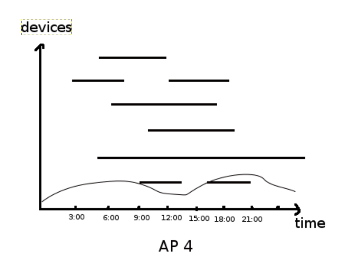
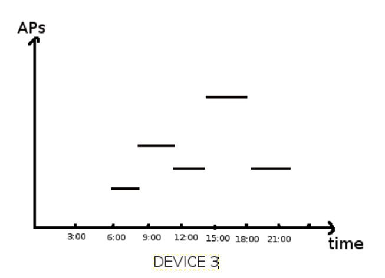
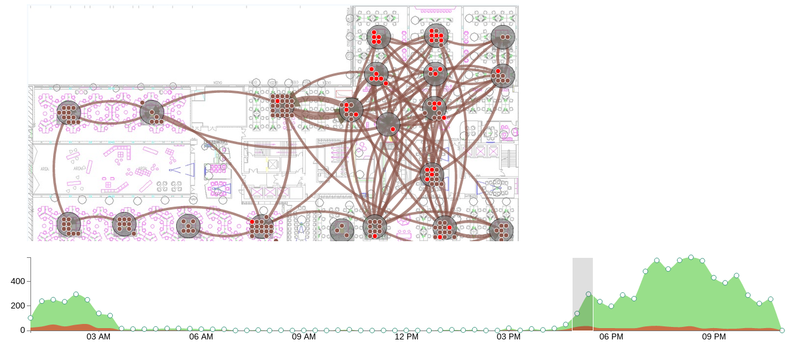
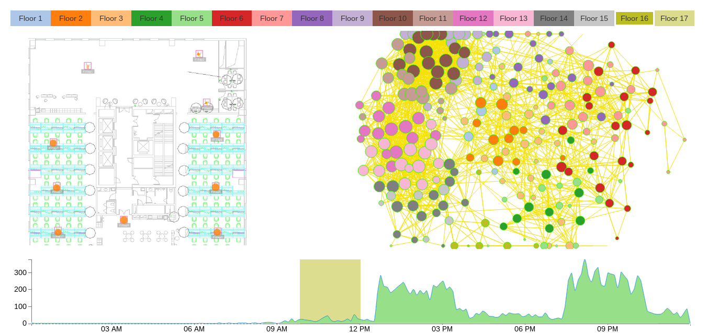
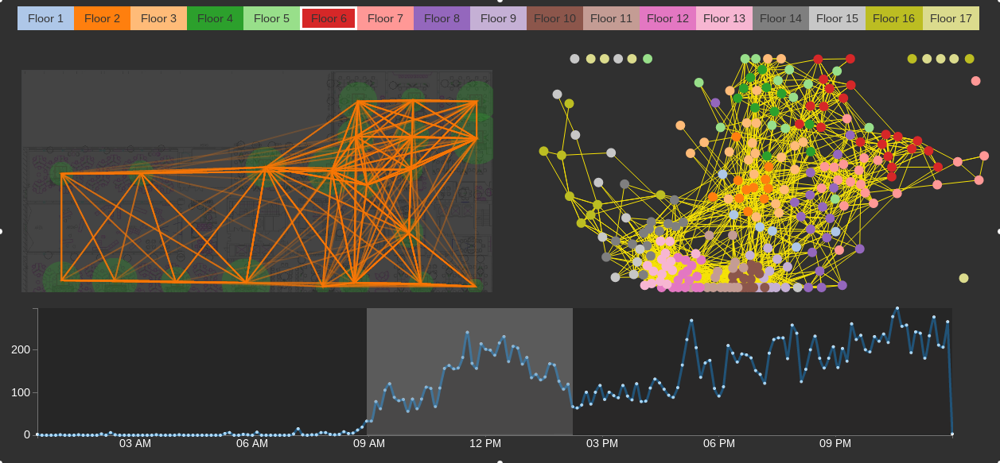
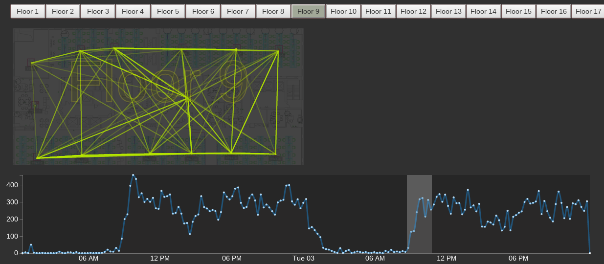

# Wiki Update

## Progress.

### 2015-02-11

**Today's Discussion Result:**

#### Two New Views

1. Single AP View: this view is supposed to visualize device's login activities over time on a specific(chosen) AP.  
	  
	Just like above, the x axis is time, and y axis indicates different devices,
	for one device, a segment shows a (login, logout) activity on the AP.  
	then number of device can be accumulated and drawn as line plot.  
	overlap or repeating can be used to show whether there are patterns over time for a device or some devices.
	for example, overlap plot of day1, day2, day3 to see the results.
	**Uncertainty**:  
	For we don't have logout records, logout activities are known by login activity on other AP.
	There may some devices that will stay all the time on AP under the condition,
	but device(person) may be out actually. This is the uncertainty.  
	So, we need to take this into consideration, for example, set a timeout for device.  
	**Have a look at how many devices will appear on a AP in one day**

2. Single Device View: this view is suppose to visualize the activities on a set of APs for a device or some devices. this is focus on devices.  
	  
	x axis indicates time and y axis indicates different APs,	for a device, we can plot its path on these APs,
	for example, _device1_ is on _AP1_ in time range (9:00, 10:00), and on _AP3_ in range (10:00, 12:00) ...  
	Uncertainty is in this view too.

in two views above, one is focus on AP's activity and one is on device activity, each one shows some aspects on AP for device,
for different APs or device, histograms can be used to compare(**THIS PART TO BE DISCUSSED**).

- view 1 is suppose to show different types of APs, meeting rooms, office or other functional based type.
- view 2 is suppose to show different person activities, visitors, regular stuffs or something else.

### Problems in current version

- background opacity
- put arrow out of circle
- show AP or link info when hover
- the timeline bug
- may color or circle shape as staing time for a device
- virtual AP in every floor, which are used to show floor change of device.
- color scale for floors

### 2015-02-10



on floor 6, day of 20130902, 01:00-23:00

what have done:

- track the device location change over time, when brush in timeline is moveing, device location changes.
- hover on a AP, show records change over time in timeline view.
- link width as traffic between APs.

to do next:

- put the arrow out of circle(AP).
- use a more reasonalble y scale in timeline
- rewrite the AP graph view 

problems:

- projection of the time and data is wrong, this is cause by time zone issue when converting time.
- colurs used are terrible
- bugs in device location tracking, need to recheck

### 2015-02-08

in the data: same device may log in a AP in very short time,
this may caused by network instability.
so when computing path for a device, only record differs with previous in AP are kept.


### 2015-02-07



update:

- changed color scheme and view size.
- adjust force layout's parameters.

summary of what to modify(from 0206's and 0207's discuss):

1. color scheme change
2. problems of views positon when in different window size
3. animate every MAC's position change, ref to [link](http://apps.opendatacity.de/relog/). support MAC selection.
4. timeline of chosen AP
5. collaboration between views

(aboves need quick implementation)

6. data input entrance
7. classification of APs and MACs


**TODO**

1. 考虑单辆车的行为
2. 更新wiki
3. 收集文章（看下祖祖去年的文章）

**Today's Goal**

rewrite basic version and update

### 2015-02-06

**TODO**

1. Force layout 修改参数，固定其位置
	- 如何生成path
2. 颜色主题由黑色改成白色
3. 窗口大小改变时更新画图
4. 实现[网页](http://apps.opendatacity.de/relog/)中的功能
	- 用点表示设备，提供设备的筛选
5. 点选单个AP或者Device时显示其Timeline
6. 显示某个Device或者某几个Device的运动轨迹
7. 几个view之间要可以相互link, highlight
8. 提供数据输入的入口
9. AP分类
	- 登录的人数、登录的时间、停留的时间等
10. Device分类

思考：

- 如何计算某个时间点AP上的人数
- 每个AP上点如何布局

### 2015-02-04

Current version:



(records data is on day of 2013-09-02, Monday)

- 283876 records on 250 APs
- number of access to one AP is between [13,4512].
		2/3 is below 1500.
		when generate path for a device(MAC address),
		only one of neighbouring records on same AP is reserved.
- among 250 APs, there are 2549 links, the weigh of link is between [1,641], which represent how many path on this link. most of these number is below 50.

What update:

- Rewrite and simplify the implementation
-	Add color to Floor Nav bar
- Add AP Graph to show aps relationship

Still many problems:

- Some Aps share the some position
	```
	3,f1ap1,0,0,1
	2,f1ap2,0,0,1
	7,f1ap3,0,0,1
	4,f1ap4,0,0,1
	```
- Path direction haven't been shown up both in Floor Plan and AP Graph
- In th AP Graph, nodes and links are clustered. May nodes and links should be filtered.
- How to generate a reasonable path using wifi records?
- Other infomation?

Todo next:

- Seperate different directon of path


### 2015-02-02

#### Implement Goals

a demo to show the wifi data and to show the data propertiy.

people flow change over time reflected by the mac path in data, 
what't the movement charater? 
What other events canbe shown in this data?

#### What have been done so far

compared to version of Saturday, I changed the layout and color scheme, 
some data process were move to server end;



records on 2013-09-02 and 2013-09-03 are loaded

- timeline view: show the mac number over time
- floor detail view: show the aps and path in this floor.

#### What to do next

- to show all the aps in one view, using force layout
- seperate path of different direction.
- show the mac number change overtime in selected ap.

