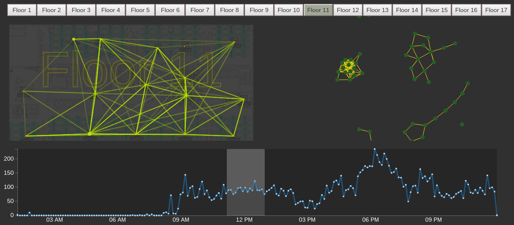

# Wiki Update

## 2015-02-03

### need to change

1. Floor Detail View: remove floor label and hilight floor button with similar color.
2. Force Layout: **color as floor**, set **threshold** to node (ap) and link (path).

	


## 2015-02-02

### Data Detail

There are 17 floors in the building of 360, and in each floor, there are several wifi AP station(hotspot),
now we have the plan of each floor and the position of AP in each floor.
When a device (pc or cell phone) get access to a AP, the AP takes a record.

So, now we have three type of data:

1. Plan figure of each floor, these firues do not share the same size (resolution). **1-17** Floor.

2. The AP Info
	Each AP has four attributes:
	- ID: ids is no continues, between 1 to 389, **250 total**.
	- Name: AP name, floor+ap_number style, "f15ap12, f1ap2" etc.
	- Floor: which floor does this ap locate
	- (x,y): position of AP

	```
	+----+------+---+---+-------+
	| ID | Name | x | y | floor |
	+----+------+---+---+-------+
	```
3. AP access record
	- date_time: access time
	- mac: end devices'MAC address, which is unique to devices.
	- ap id: id of AP the device accesses to.

	```
	+-----------+-----+------+
	| date_time | mac | apid |
	+-----------+-----+------+
	```
	
Now we have data in **September 2013** as a sample.

record summary as below: _IMAGE_

### Implement Goals

a demo to show the wifi data and to show the data propertiy.

people flow change over time reflected by the mac path in data, 
what't the movement charater? 
What other events canbe shown in this data?

### What have been done so far

compared to version of Saturday, I changed the layout and color scheme, 
some data process were move to server end;


records on 2013-09-02 and 2013-09-03 are loaded

- timeline view: show the mac number over time
- floor detail view: show the aps and path in this floor.

### What to do next

- to show all the aps in one view, using force layout
- seperate path of different direction.
- show the mac number change overtime in selected ap.

