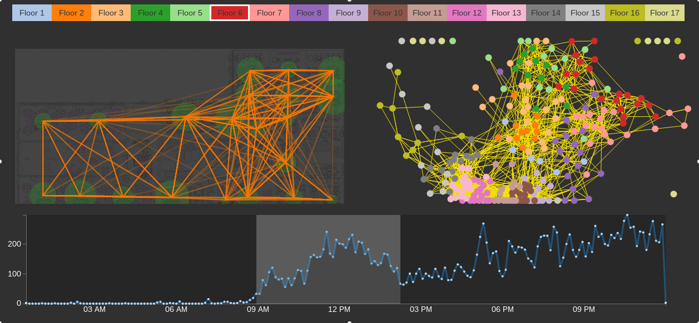

# Wiki Update

## 2015-02-06

**TODO**

1. Force layout 修改参数，固定其位置
	- 如何生成path
2. 颜色主题由黑色改成白色
3. 窗口大小改变时更新画图
4. 实现[网页](http://apps.opendatacity.de/relog/)中的功能
	- 用点表示设备，提供设备的筛选
5. 点选单个AP或者Device时显示其Timeline
6. 显示某个Device或者某几个Device的运动轨迹
7. 几个view之间要可以相互link, highlight
8. 提供数据输入的入口
9. AP分类
	- 登录的人数、登录的时间、停留的时间等
10. Device分类

思考：

- 如何计算某个时间点AP上的人数
- 每个AP上点如何布局

## 2015-02-04

Current version:



(records data is on day of 2013-09-02, Monday)

- 283876 records on 250 APs
- number of access to one AP is between [13,4512].
		2/3 is below 1500.
		when generate path for a device(MAC address),
		only one of neighbouring records on same AP is reserved.
- among 250 APs, there are 2549 links, the weigh of link is between [1,641], which represent how many path on this link. most of these number is below 50.

What update:

- Rewrite and simplify the implementation
-	Add color to Floor Nav bar
- Add AP Graph to show aps relationship

Still many problems:

- Some Aps share the some position
	```
	3,f1ap1,0,0,1
	2,f1ap2,0,0,1
	7,f1ap3,0,0,1
	4,f1ap4,0,0,1
	```
- Path direction haven't been shown up both in Floor Plan and AP Graph
- In th AP Graph, nodes and links are clustered. May nodes and links should be filtered.
- How to generate a reasonable path using wifi records?
- Other infomation?

Todo next:

- Seperate different directon of path


## 2015-02-02

### Data Detail

There are 17 floors in the building of 360, and in each floor, there are several wifi AP station(hotspot),
now we have the plan of each floor and the position of AP in each floor.
When a device (pc or cell phone) get access to a AP, the AP takes a record.

So, now we have three type of data:

1. Plan figure of each floor, these firues do not share the same size (resolution). **1-17** Floor.

2. The AP Info
	Each AP has four attributes:
	- ID: ids is no continues, between 1 to 389, **250 total**.
	- Name: AP name, floor+ap_number style, "f15ap12, f1ap2" etc.
	- Floor: which floor does this ap locate
	- (x,y): position of AP

	```
	+----+------+---+---+-------+
	| ID | Name | x | y | floor |
	+----+------+---+---+-------+
	```
3. AP access record
	- date_time: access time
	- mac: end devices'MAC address, which is unique to devices.
	- ap id: id of AP the device accesses to.

	```
	+-----------+-----+------+
	| date_time | mac | apid |
	+-----------+-----+------+
	```
	
Now we have data in **September 2013** as a sample.

### Implement Goals

a demo to show the wifi data and to show the data propertiy.

people flow change over time reflected by the mac path in data, 
what't the movement charater? 
What other events canbe shown in this data?

### What have been done so far

compared to version of Saturday, I changed the layout and color scheme, 
some data process were move to server end;


records on 2013-09-02 and 2013-09-03 are loaded

- timeline view: show the mac number over time
- floor detail view: show the aps and path in this floor.

### What to do next

- to show all the aps in one view, using force layout
- seperate path of different direction.
- show the mac number change overtime in selected ap.

